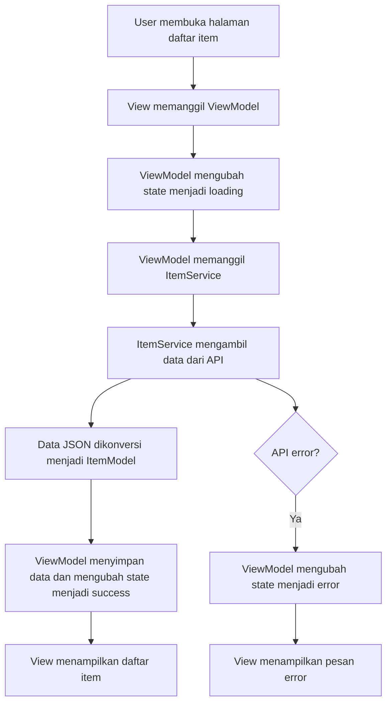

# repo-p13-23343082

## Pair Programming Virtual - Implementasi MVVM dengan VS Code Live Share

**Nama Ketua:** Rendi Aigo Brandon  
**NIM Ketua:** 23343082  
**Nama Anggota 2:** Muhammad Rafki  
**NIM Anggota 2:** 23343078 
**Mata Kuliah:** Mobile Programming Lanjutan  
**Pertemuan:** 13  
**Topik:** Design Patterns: MVC, MVVM, dan Clean Architecture di Flutter  

---

## 1. Deskripsi Proyek

Repository ini berisi hasil pair programming virtual menggunakan **VS Code Live Share**. Fitur yang diimplementasikan adalah **halaman daftar item dengan API call** menggunakan pola arsitektur **MVVM (Model-View-ViewModel)**.

Aplikasi mengambil data dari API, memproses data melalui service, mengelola state melalui ViewModel, lalu menampilkan data pada View.

---

## 2. Pola Arsitektur yang Digunakan

Pola arsitektur yang digunakan adalah **MVVM**.

### Alasan memilih MVVM

MVVM dipilih karena sesuai untuk aplikasi Flutter sederhana hingga menengah. Pola ini memisahkan tanggung jawab antara:

- **Model:** merepresentasikan struktur data.
- **View:** menampilkan UI dan menerima input pengguna.
- **ViewModel:** mengelola state, melakukan pemanggilan service, dan menyediakan data untuk View.

Dengan pemisahan ini, kode menjadi lebih rapi, mudah diuji, dan lebih mudah dikembangkan dibandingkan menaruh semua logika pada satu widget.

---

## 3. Struktur Folder

```text
lib/
├── models/
│   └── item_model.dart
├── services/
│   └── item_service.dart
├── viewmodels/
│   └── item_viewmodel.dart
├── views/
│   └── item_list_view.dart
└── main.dart
```

---

## 4. Alur Aplikasi



---

## 5. Package yang Digunakan

Tambahkan package berikut pada `pubspec.yaml`:

```yaml
dependencies:
  flutter:
    sdk: flutter
  provider: ^6.1.2
  http: ^1.2.2
```

---

## 6. Cara Menjalankan Proyek

1. Clone repository.
2. Jalankan perintah:

```bash
flutter pub get
```

3. Jalankan aplikasi:

```bash
flutter run
```

---

## 7. File Penting

- `lib/models/item_model.dart`  
  Berisi model data item.
- `lib/services/item_service.dart`  
  Berisi fungsi pengambilan data dari API.
- `lib/viewmodels/item_viewmodel.dart`  
  Berisi state management menggunakan `ChangeNotifier`.
- `lib/views/item_list_view.dart`  
  Berisi tampilan daftar item.
- `PAIR_SESSION.md`  
  Berisi dokumentasi sesi pair programming.

---

## 8. Hal yang Ingin Diperbaiki Jika Ada Waktu Lebih

Jika memiliki waktu lebih, aplikasi ini dapat dikembangkan dengan:

1. Menambahkan fitur pencarian item.
2. Menambahkan pull-to-refresh.
3. Menambahkan unit test untuk ViewModel.
4. Menambahkan tampilan detail item.
5. Menambahkan error handling yang lebih lengkap.

---

## 9. Kesimpulan

Melalui pair programming ini, pola MVVM dapat diterapkan untuk memisahkan tampilan, logika state, dan pengambilan data. Dengan bantuan VS Code Live Share, proses kolaborasi dapat dilakukan secara virtual, sementara GitHub digunakan untuk menyimpan hasil kode dan dokumentasi sesi.
